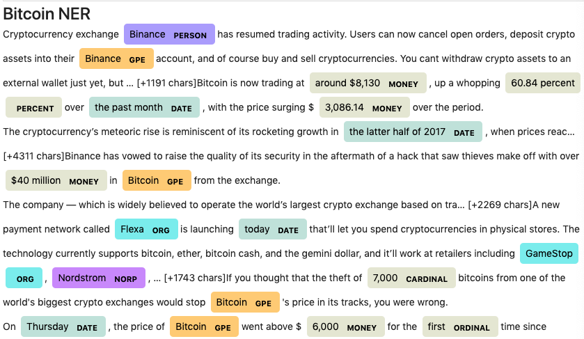

# Tales from the Crypto

## Background

There's been a lot of hype in the news lately about cryptocurrency, so you want to take stock, so to speak, of the latest news headlines regarding Bitcoin and Ethereum to get a better feel for the current public sentiment around each coin.

In this project, I will apply natural language processing to understand the sentiment in the latest news articles featuring Bitcoin and Ethereum. I will also apply fundamental NLP techniques to better understand the other factors involved with the coin prices such as common words and phrases and organizations and entities mentioned in the articles.

I Completed the following tasks:

1. [Sentiment Analysis](#Sentiment-Analysis)
2. [Natural Language Processing](#Natural-Language-Processing)
3. [Named Entity Recognition](#Named-Entity-Recognition)

---

#### Sentiment Analysis

The main api I used was the [newsapi](https://newsapi.org/) to pull the latest news articles for Bitcoin and Ethereum and create a DataFrame of sentiment scores for each coin.

I used descriptive statistics to answer the following questions:

> Which coin had the highest mean positive score?
>
> Which coin had the highest negative score?
>
> Which coin had the highest positive score?

#### Natural Language Processing

In this section, I used NLTK and Python to tokenize the text for each coin.

1. Lowercase each word
2. Remove punctuation
3. Remove stop words

Next, I did ngrams and word frequency for each coin.

1. NLTK to produce the ngrams for N = 2.
2. List the top 10 words for each coin.

Finally, I generated word clouds for each coin to summarize the news for each coin.

#### Named Entity Recognition

In this section, I built a named entity recognition model for both coins and visualized the tags using SpaCy.

---

### Resources reference

[Vader Sentiment Analysis](http://www.nltk.org/howto/sentiment.html)

